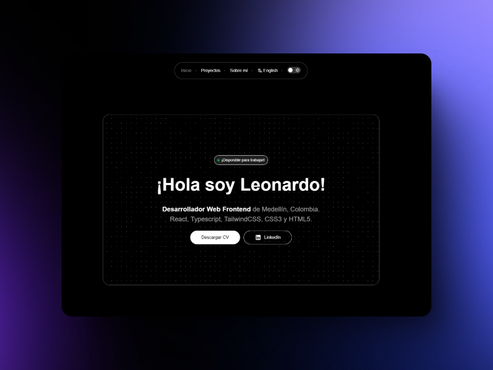

# 🚀 Portafolio de Leonardo Salazar



Bienvenido a mi portafolio de desarrollo web. Aquí encontrarás mis proyectos, tecnologías favoritas y cómo contactarme.

## 🌟 Sobre Mí
Actualmente estoy finalizando mi carrera como técnico en programación de software. Tengo un enfoque en desarrollo Frontend y tengo habilidades básicas de diseño web. También estoy explorando un poco sobre Backend.

## 🛠️ Tecnologías
Algunas de las herramientas y tecnologías que utilizo:

**Frontend:** React, Typescript, TailwindCSS
**Backend:** (estudiando): Java, Spring
**Base de datos:** (estudiando): SQL
**Otras herramientas:** Figma, Supabase, AWS(en formación)

## 🚀 Cómo Clonar este Repositorio

Si deseas clonar este repositorio, utiliza el siguiente comando en tu terminal:

```sh
git clone https://github.com/developerleonardo/portfolio-leonardo.git
```

## Agradecimientos
Quisiera dar un agradecimiento muy especial a [Ana Rangel](https://www.linkedin.com/in/ux-ana-rangel/) y [Felix Icaza](https://felixicaza.com/) por el diseño de este portafolio y la plantilla proporcionada para su edición.

## 📬 Contacto
Si te interesa colaborar o tienes alguna pregunta, puedes encontrarme en:

💼 [LinkedIn](https://www.linkedin.com/in/leonardo-salazar-serna/)
